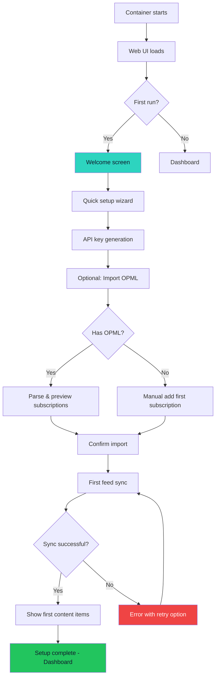
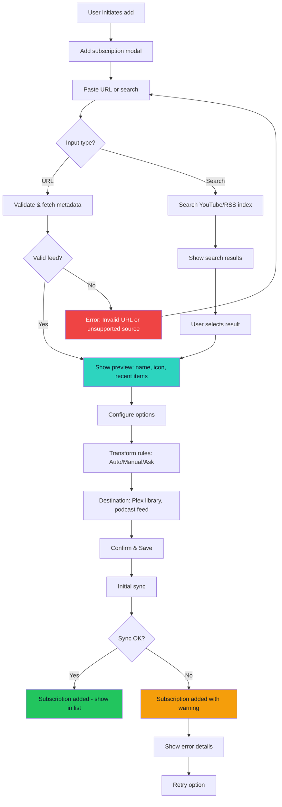

# UX Design Specification rss-remastered

**Author:** Mo
**Date:** 2025-12-13

---

## Executive Summary

### Project Vision

**RSS-Remastered** restores *subscription sovereignty* - the radical premise that when you subscribe to content, you should receive it when published, not when an algorithm decides. It's a self-hosted media aggregation and transformation tool for users who already run the *arr stack (Sonarr, Radarr, Prowlarr) and want to extend their media sovereignty to YouTube subscriptions, RSS feeds, and podcasts.

The killer feature isn't just aggregation - it's **intelligent transposition**. Content transforms across formats: a 45-minute YouTube video becomes a readable article for lunch, an article becomes audio for the commute. Same content, user's format, user's choice. The transformation is smart - visual references become verbal descriptions, timestamps become natural transitions.

**Tagline:** "Nothing buried, nothing missed."

### Target Users

| Persona | Technical Level | Primary Need | Interaction Model |
|---------|----------------|--------------|-------------------|
| **Marcus** (Power User) | Expert - runs *arr stack | Control, visibility, chronological feeds | Web UI power user |
| **Sofia** (Household Consumer) | Non-technical | "Just works" in Plex/podcatcher | Zero direct UI interaction |
| **Jordan** (API Builder) | Developer | Programmable automation | API-first, no web UI |

**Primary design target:** Marcus. Sofia and Jordan consume through other channels (Plex, podcast apps, API) - the web UI is Marcus's domain.

### Key Design Challenges

1. **The Power/Simplicity Paradox** - Marcus wants visibility into queue depths, error states, and system health. Sofia wants to never see the web UI. One product serving radically different interaction models through different channels.

2. **Error as First-Class UX** - Rate limits, malformed feeds, failed transformations are expected states, not edge cases. The UI must make errors *comprehensible and actionable*, not just visible. Users should always know what's happening and what they can do about it.

3. **Dark Mode Dashboard Aesthetic** - Self-hosters live in dark UIs (Sonarr, Radarr, Portainer). The visual language must feel native to this ecosystem while supporting system preference detection for flexibility.

4. **PWA Multi-Channel Architecture** - Web UI serves Marcus, generated podcast feeds serve Sofia's apps, API serves Jordan's automations. Each channel has distinct UX requirements.

### Design Opportunities

1. **"Nothing Buried" as Visual Language** - Make the chronological guarantee feel intentional. No recommendations, no algorithmic suggestions. The absence of manipulation should feel like a feature, not emptiness.

2. **Transformation Status as Storytelling** - Show the magic happening: "Extracting subtitles... Converting visual references... Cleaning verbal artifacts..." Turn progress into engagement.

3. **Error Recovery as Empowerment** - When feeds fail, show exactly what happened with clear actions. Match the *arr stack ethos of "I understand and control my system."

## Core User Experience

### Defining Experience

RSS-Remastered follows the ***arr stack* interaction model** - a control plane for system management, not a daily consumption destination. Users configure, monitor, and maintain; actual content consumption happens in dedicated apps (podcast players, Plex, RSS readers).

**Primary Interaction Pattern:** Set-and-forget automation
- **Initial setup burst** - Heavy interaction while configuring subscriptions, transformations, integrations
- **Occasional additions** - New channel discovered, quick add, done
- **Triage when notified** - Something broke, come fix it, leave

The web UI serves Marcus when he needs to:
- Check system health at a glance
- Manage subscriptions and media sources
- Troubleshoot errors and perform maintenance
- Configure transformation and integration settings

### Platform Strategy

| Aspect | Decision |
|--------|----------|
| **Primary Platform** | Web-first PWA |
| **Primary Context** | Desktop workstation (server management) |
| **Secondary Context** | Mobile for quick health checks |
| **Theme** | Dark mode default, system preference detection |
| **Interaction Model** | Mouse/keyboard primary, touch-functional |

### Visual Direction: Modern *arr Craft

**Design Philosophy:** "Same soul, better bones" - Overseerr-level polish applied to Sonarr-style purpose.

| Borrow From Overseerr | Keep From *arr DNA | Unique to RSS-Remastered |
|-----------------------|--------------------| -------------------------|
| Modern card components | Status indicators first-class | "Calm technology" aesthetic |
| Clean typography hierarchy | Dense-when-needed capability | Transformation storytelling |
| Subtle depth (shadows, gradients) | Settings depth for power users | Error messages that teach |
| Mobile-responsive grid | Clear system health visibility | Companion-ready components |
| Unified dark theme | | |

**Critical Distinction:** Overseerr's polish serves *discovery and browsing* - users linger and explore. RSS-Remastered's polish serves *efficiency and confidence* - users verify, fix, and leave.

| Dimension | Overseerr | RSS-Remastered |
|-----------|-----------|----------------|
| **Primary emotion** | Delight, discovery | Confidence, control |
| **Time spent** | Browsing sessions | Brief check-ins |
| **Success state** | "Ooh, I want to watch that!" | "Good, nothing's broken" |
| **Visual priority** | Content imagery | System status |
| **Invitation** | "Come explore" | "All clear, carry on" |

### Calm Technology Dashboard Model

**Healthy State:**
- Minimal, almost zen-like
- Green indicator or simple "All systems healthy"
- Quick actions visible: Add Subscription, Settings
- Subtle "last checked" timestamp
- Empty state IS the success state - no vanity metrics

**Unhealthy State:**
- Errors promoted to primary visual hierarchy
- Red/amber indicators impossible to miss
- Each error expandable with context + actions
- "Healthy" elements fade to background
- Optimized for fast re-orientation after weeks away

### Effortless Interactions

These should require zero thought from Marcus:

1. **System status visibility** - Health state obvious within 2 seconds of landing
2. **Feed refresh** - Automatic, no manual "check for updates" needed
3. **Transformation queuing** - One action to request, system handles the rest
4. **Error surfacing** - Problems come to Marcus, he doesn't hunt for them
5. **Re-orientation** - Easy to understand state after days away from the UI

### Light-Touch Media Consumption

The web UI provides functional media preview capabilities for verification and convenience:

| Media Type | MVP Capability | Purpose |
|------------|----------------|---------|
| **Article** | Basic reader view | Verify transformation quality, quick read |
| **Audio** | Simple player controls | Confirm output, spot check |
| **Video** | *Deferred to post-MVP* | Preview via Plex/Jellyfin |

These are **verification and convenience features**, not the primary consumption experience.

### Critical Success Moments

1. **First dashboard load** - Marcus immediately understands system health
2. **First transformation preview** - The "aha" that transposition actually works
3. **First error encounter** - Clear, actionable, not frustrating
4. **Return after absence** - Quick re-orientation, no confusion

### Forward-Compatible Architecture

The UI architecture must support future evolution without major restructure:

| Phase | Primary User | UI Focus |
|-------|--------------|----------|
| **MVP** | Marcus (admin) | Control plane, system health |
| **v1.x** | Marcus + Sofia access | Control plane + light media views |
| **v2+** | All personas | Control plane + media discovery + companion |

**Layered UI Architecture:**

1. **Shell (Stable)** - App frame, navigation, theming; supports multiple modes
2. **Views (Expandable)** - Dashboard, Subscriptions, Queue, Settings; future: Browse, Companion
3. **Components (Reusable)** - Context-agnostic units that work across dashboard, browse, AND companion responses

**Design Principle:** Components should work in any context. A "subscription card" displays health status on the dashboard, shows recent content in browse view, and serves as a companion response - same component, different context.

### Experience Principles

1. **Control Plane First, Media Later** - MVP is admin-focused; architecture supports future media-forward views
2. **Modern *arr Craft** - Overseerr-level polish, Sonarr-style purpose
3. **Calm Technology** - Quiet when healthy, clear when broken
4. **Infrequent Confidence** - Optimized for users who visit weekly, not daily
5. **Component-First Architecture** - Reusable units that work across contexts
6. **Expandable Shell** - Navigation and layout that grows without restructuring
7. **Intent-Driven Design** - Every decision serves "confidence and control"

### Future Consideration: Companion Features

The v2+ companion features (conversational selection, content Q&A, cross-source synthesis) may transform the web UI from occasional control plane to daily destination. Current architecture accommodates this evolution:

- Chat interface integration point
- Conversation-driven content discovery
- Components designed to render as companion responses
- Media-forward views can be added without restructuring shell

## Desired Emotional Response

### Primary Emotional Goals

**Confidence** is the dominant emotional chord. When Marcus interacts with RSS-Remastered, he should feel:

1. **Confident** - "I understand exactly what's happening in my system"
2. **In Control** - "I own this pipeline completely, no black boxes"
3. **Calm** - "Everything is working as expected" or "I know exactly what's wrong"
4. **Private** - "My data stays mine, nothing phones home without my consent"

**The Subscription Sovereignty Feeling:**
- **Liberation** - Free from algorithmic manipulation
- **Trust** - The system shows what I asked for, period
- **Vindication** - "See, THIS is how it should work"
- **Privacy** - My subscriptions, my consumption patterns, my data - all mine

### Privacy as Core Emotional Need

Self-hosters choose self-hosting *because* of privacy and control. RSS-Remastered must reinforce this choice:

| Privacy Dimension | Emotional Payoff |
|-------------------|------------------|
| **No telemetry by default** | Trust - "This respects my choice to self-host" |
| **Local-first AI option** | Control - "I can run this without cloud dependencies" |
| **Transparent network calls** | Confidence - "I know exactly what talks to the internet" |
| **No account required** | Autonomy - "I own this, no vendor relationship" |
| **Data stays local** | Security - "My consumption patterns are private" |

**Design Implication:** Any external network call (YouTube API, AI provider, etc.) should be visible and configurable. Users should never wonder "what is this sending out?"

### The "Sovereign AI" Emotional Opportunity (v2+ Companion)

**The Market's False Binary:**

| Option | What You Get | What You Sacrifice |
|--------|--------------|-------------------|
| **Big Tech Algorithms** | Smart recommendations, discovery, "magic" | Privacy, autonomy, being the product |
| **Self-Hosted / RSS** | Privacy, control, transparency | Dumb feeds, no discovery, manual curation |

**RSS-Remastered breaks this binary.**

The v2+ companion creates a third category - **Sovereign AI**: AI that works for YOU, trained on YOUR preferences, running on YOUR terms.

*"Remember when technology felt like magic, not manipulation? It can again."*

**Emotional Payoff of Ethical AI:**

| Feeling | What Triggers It |
|---------|------------------|
| **Excitement** | "I get smart recommendations WITHOUT selling my soul" |
| **Vindication** | "Finally, AI that serves me, not advertisers" |
| **Delight** | Discovery and synthesis that *actually helps* |
| **Trust** | "This AI knows my preferences because I told it, not because it stalked me" |
| **Pride** | "My setup does what Google does, but ethically" |

**The Core Emotional Promise:** *"All the magic of algorithmic discovery. None of the exploitation."*

### Trust-Building Design for Ethical AI

Trust is *earned through transparency*, not claimed through marketing.

**Empathy Journey for Ethical AI:**

| Stage | User Feeling | Design Response |
|-------|--------------|-----------------|
| **First Exposure** | Skepticism | Transparent explanation of HOW it works |
| **Setup** | Cautious hope | Clear privacy controls, visible data locality |
| **First Suggestion** | Testing | Explainable: "I suggested this because..." |
| **Pattern Emerges** | Growing trust | Consistent, non-creepy behavior |
| **Full Adoption** | Excitement + Pride | "This is what tech SHOULD be" |

**Trust-Building UX Patterns:**

1. **Radical Transparency** - "How does this work?" always one click away; AI decisions are explainable, not black box
2. **Earned Not Claimed** - Don't *say* "we respect your privacy" - *show* it through visible behavior
3. **The "Not Creepy" Test** - Suggestions should feel helpful, never surveillance-y; user should always understand how the AI "knows" something
4. **Calm by Default, Transparent on Demand** - Suggestions appear cleanly with subtle "why this?" affordance; clicking reveals reasoning

### Emotional Journey Mapping

| Stage | Desired Emotion | Design Implication |
|-------|-----------------|-------------------|
| **First Discovery** | Curiosity + Recognition | "This is what I've been looking for" - README resonates with *arr stack users |
| **Initial Setup** | Accomplishment + Anticipation | Wizard-like guidance, quick wins, visible progress |
| **Privacy Configuration** | Confidence + Control | Clear options for local vs. cloud, visible what calls external services |
| **Daily Operation** | Absence of emotion (calm) | Set-and-forget working silently; no news is good news |
| **Health Check** | Relief + Confidence | Quick glance confirms all systems go |
| **Error Encounter** | Clarity + Agency | "I see what's wrong and I can fix it" - not frustration |
| **Transformation Preview** | Delight + Satisfaction | The "aha" moment - "This actually works!" |
| **Companion Discovery (v2+)** | Excitement + Trust | "Smart suggestions that don't feel creepy" |
| **Return After Absence** | Quick Orientation | Immediate comprehension, no re-learning curve |

### Micro-Emotions

**Prioritized Emotional States:**

| Pursue | Avoid |
|--------|-------|
| Confidence | Confusion |
| Trust | Skepticism |
| Calm | Anxiety |
| Privacy | Surveillance concern |
| Excitement (companion) | Exploitation feeling |
| Accomplishment | Frustration |
| Agency | Helplessness |
| Satisfaction | Overwhelm |

**The "Nothing Buried" Calm:**
Unlike social media's FOMO-inducing feeds, RSS-Remastered should create a sense of *completeness*. When Marcus sees his feed, he knows:
- Everything he subscribed to is there
- Nothing is hidden or deprioritized
- He can trust what he sees
- No one else knows what he's watching

This absence of manipulation - and surveillance - should feel peaceful, not empty.

### Design Implications

| Emotional Goal | UX Design Approach |
|----------------|-------------------|
| **Confidence** | Clear status indicators, predictable behavior, no mystery states |
| **Control** | Every automated action is visible and overridable |
| **Privacy** | Visible network activity, local-first options, no hidden telemetry |
| **Calm** | Minimal healthy state, no attention-grabbing when unnecessary |
| **Clarity (in errors)** | Human-readable messages, suggested actions, no jargon dumps |
| **Agency** | Retry buttons, manual overrides, visible queue management |
| **Delight (in transformation)** | Progress storytelling, quality preview, "magic" moments |
| **Trust** | Chronological feeds, no algorithmic sorting, transparent behavior |
| **Ethical AI Excitement** | Companion features feel helpful, not creepy; explainable, not black box |

### Privacy-Specific UX Patterns

1. **Network Transparency** - Settings clearly show what services are contacted and why
2. **Local-First Defaults** - Cloud/external services are opt-in, not opt-out
3. **No Silent Phoning Home** - If the system calls external services, it's visible and logged
4. **Data Locality Clarity** - Clear indication of where data lives (all local vs. cloud AI)
5. **AI Provider Choice** - Visible selection between local models and cloud providers with privacy trade-off explained

### Companion-Specific UX Patterns (v2+)

1. **Explainable Recommendations** - "Why this?" always answerable
2. **Explicit Preference Teaching** - User actively trains, not passive surveillance
3. **No Engagement Optimization** - Suggestions serve user goals, not time-on-app
4. **Preference Portability** - User owns their preference model, can export/delete
5. **Graceful Without AI** - Companion enhances but isn't required

### Emotional Anti-Patterns to Avoid

1. **Mystery States** - Never leave Marcus wondering "is this working?"
2. **Alarm Fatigue** - Don't cry wolf; errors should be meaningful
3. **Jargon Dumps** - Error messages should teach, not frustrate
4. **Hidden Automation** - Every automatic action should be discoverable
5. **Vanity Metrics** - Don't show data that doesn't serve a purpose
6. **FOMO Design** - No badges, notifications, or urgency where none exists
7. **Surveillance Vibes** - Never collect, track, or transmit data without explicit visibility
8. **Creepy Suggestions** - Recommendations should feel helpful, never "how did it know that?"

### Emotional Design Principles

1. **Calm is the Goal** - The best emotional state is the absence of negative emotion
2. **Privacy is Trust** - Self-hosters chose sovereignty; honor that choice visibly
3. **Ethical AI is Possible** - Smart features don't require exploitation
4. **Errors are Teaching Moments** - Frustration converts to understanding through good UX
5. **Trust Through Transparency** - Show the system's behavior, don't hide complexity
6. **Delight in Craft** - Small moments of polish signal care and quality
7. **Sovereignty Feels Peaceful** - The absence of manipulation should feel like relief, not emptiness

## UX Pattern Analysis & Inspiration

### Inspiring Products Analysis

#### Sonarr / Radarr (The *arr Stack Foundation)

**What They Do Well:**
- Clear status indicators (downloading, seeding, monitored, missing)
- Dense but scannable information hierarchy
- Consistent dark theme across the ecosystem
- Settings depth for power users without overwhelming defaults
- Error states are visible and actionable

**What to Learn:**
- Status-first dashboard design
- Muscle memory across ecosystem tools
- "Boring technology that works" aesthetic
- Power user features available but not mandatory

**Limitations to Improve Upon:**
- Dated visual styling (Bootstrap 3 era)
- Mobile experience is an afterthought
- Error messages can be cryptic
- No progressive disclosure - everything shown at once

#### Overseerr / Jellyseerr (Modern *arr Evolution)

**What They Do Well:**
- Modern card-based layouts with good spacing
- Clean typography hierarchy
- Mobile-responsive design from the start
- Unified dark theme that feels premium
- Streamlined request workflows

**What to Learn:**
- Modern visual craft is achievable in this ecosystem
- Card components with subtle depth (shadows, gradients)
- Mobile-first responsive grid
- Polish signals quality and care

**What to Avoid:**
- Media-discovery-first focus (not our use case)
- Browsing/lingering interaction model
- Consumer-facing aesthetic priorities

#### Portainer (Docker Management)

**What They Do Well:**
- System health at a glance
- Container status clear and actionable
- Clean navigation between resources
- Error states prominent but not alarming

**What to Learn:**
- Control plane dashboard patterns
- Resource health visualization
- Quick action accessibility
- Technical information presented cleanly

#### Linear (Issue Tracking Excellence)

**What They Do Well:**
- Keyboard-first design with command palette
- Exceptional visual polish without sacrificing function
- Status and progress visibility
- Calm when nothing needs attention

**What to Learn:**
- Keyboard shortcuts for power users
- Command palette for quick actions
- Polish as a trust signal
- Minimal chrome, maximum content

### Transferable UX Patterns

#### Navigation Patterns

| Pattern | Source | Application to RSS-Remastered |
|---------|--------|------------------------------|
| **Sidebar navigation** | Sonarr, Portainer | Primary navigation for views (Dashboard, Subscriptions, Queue, Settings) |
| **Command palette** | Linear, Raycast | Quick actions and navigation for power users (v1.x) |
| **Breadcrumbs** | Portainer | Context in nested views (subscription → episode → transformation) |

#### Status & Health Patterns

| Pattern | Source | Application to RSS-Remastered |
|---------|--------|------------------------------|
| **Traffic light indicators** | Sonarr, Portainer | Feed health (green/amber/red) |
| **Status badges on cards** | Overseerr | Transformation status, subscription state |
| **Health summary bar** | Portainer | Dashboard header with quick system status |
| **Empty state as success** | Linear | Calm dashboard when nothing needs attention |

#### Error Handling Patterns

| Pattern | Source | Application to RSS-Remastered |
|---------|--------|------------------------------|
| **Inline error expansion** | GitHub | Click to expand error details with context |
| **Suggested actions** | Linear | "Retry" / "Configure" / "Dismiss" next to errors |
| **Error grouping** | Sentry | Group similar errors (e.g., all rate-limit issues together) |
| **Human-readable messages** | Stripe | Plain language + technical details available |

#### Interaction Patterns

| Pattern | Source | Application to RSS-Remastered |
|---------|--------|------------------------------|
| **One-click actions** | Sonarr | Retry, refresh, add subscription |
| **Contextual menus** | Linear | Right-click or "..." for secondary actions |
| **Progressive disclosure** | Overseerr | Show summary, expand for details |
| **Keyboard shortcuts** | Linear | Power user efficiency |

### Anti-Patterns to Avoid

| Anti-Pattern | Why It's Wrong | What to Do Instead |
|--------------|----------------|-------------------|
| **Vanity dashboards** | Users don't care about "feeds fetched this week" graphs | Show actionable status, not metrics |
| **Dense tables everywhere** | Cognitive overload, especially after time away | Cards with progressive disclosure |
| **Cryptic error codes** | "Error 429" means nothing to most users | "Rate limited by YouTube, retry in 2h" |
| **Mobile as afterthought** | Self-hosters check systems on phones too | Mobile-first responsive design |
| **Settings overload on first run** | Overwhelming new users | Smart defaults, optional depth |
| **Notification spam** | Every event triggers alert | Meaningful notifications only |
| **Hidden automation** | "Where did that come from?" | Every automated action visible |

### Design Inspiration Strategy

#### Adopt Directly

| Pattern | From | Rationale |
|---------|------|-----------|
| **Dark theme default** | *arr ecosystem | Ecosystem native feel |
| **Sidebar navigation** | Sonarr, Portainer | Familiar, efficient |
| **Status badges** | Overseerr | Modern, glanceable |
| **Inline error expansion** | GitHub | Clear, non-intrusive |

#### Adapt for Our Context

| Pattern | From | Adaptation |
|---------|------|------------|
| **Card layouts** | Overseerr | For subscriptions/status, not media discovery |
| **Command palette** | Linear | Simplified version for common actions |
| **Health summary** | Portainer | Focused on feeds + transformations, not containers |

#### Avoid Completely

| Pattern | Why |
|---------|-----|
| **Media carousels** | Wrong interaction model (control plane, not browsing) |
| **Engagement metrics** | Counter to "calm technology" philosophy |
| **Notification badges** | Creates false urgency |
| **Discovery-first layouts** | Our primary use is triage, not exploration |

### Visual Benchmark

**Target Positioning:**

RSS-Remastered should sit between:
- **Visual polish**: Closer to Overseerr/Linear than traditional *arr
- **Information density**: Closer to Sonarr/Portainer (functional) than Overseerr (consumer)

The goal: **Overseerr's craft applied to Sonarr's purpose.**

## Design System Foundation

### Design System Choice

**shadcn/ui + Tailwind CSS** with React/Next.js

A themeable component system built on Radix UI primitives and Tailwind CSS utility classes. Components are copied into the project (not installed as dependencies), providing full ownership and customization capability.

### Rationale for Selection

| Factor | How shadcn/ui Fits |
|--------|-------------------|
| **Project Timeline** | Fast development with pre-built, accessible components |
| **Team Size** | Solo/small team benefits from proven patterns without maintenance burden |
| **Brand Requirements** | Highly themeable - dark mode native, CSS variables for full control |
| **Technical Constraints** | React/Next.js compatible, TypeScript-first, App Router ready |
| **Long-term Maintenance** | Component ownership means no breaking upstream changes |
| **AI Development Accessibility** | MCP server integration, copy-paste architecture, predictable patterns |

**AI Development Workflow Advantages:**
- **MCP Server**: shadcn has an official Model Context Protocol server - Claude Code can search, view, and understand components directly
- **Copy-Paste Architecture**: Components live in your codebase, so AI can read, understand, and modify them without external dependencies
- **Predictable Patterns**: Consistent component structure means AI can reliably generate compatible code
- **Radix Primitives**: Well-documented accessibility primitives that AI can reason about
- **Tailwind Classes**: AI models understand Tailwind syntax well due to training data prevalence

### Implementation Approach

**Component Strategy:**

| Category | Approach |
|----------|----------|
| **Base Components** | shadcn/ui primitives (Button, Card, Badge, etc.) |
| **Layout Components** | Custom, informed by shadcn patterns |
| **Domain Components** | Custom (SubscriptionCard, StatusBadge, TransformationProgress) |
| **Composite Components** | Mix of shadcn primitives + custom logic |

**Folder Structure:**
```
src/
├── components/
│   ├── ui/           # shadcn/ui base components
│   ├── layout/       # App shell, navigation, sidebars
│   └── domain/       # RSS-Remastered specific components
├── lib/
│   └── utils.ts      # cn() helper, shared utilities
└── styles/
    └── globals.css   # Tailwind config, CSS variables
```

### Theming Approach

**Dark-First Design:**
- CSS custom properties for all colors
- `prefers-color-scheme: dark` as default
- System preference detection with manual override
- Semantic color tokens (--destructive, --muted, --accent)

**Theme Token Categories:**
| Category | Purpose |
|----------|---------|
| **Background** | Surface layers (card, popover, dialog) |
| **Foreground** | Text on each background |
| **Border** | Subtle dividers and outlines |
| **Accent** | Interactive elements, focus states |
| **Status** | Success, warning, error, info |

### Component Mapping to RSS-Remastered UX

| UX Need | shadcn/ui Foundation | Customization |
|---------|---------------------|---------------|
| **Dashboard cards** | Card, Badge | StatusCard variant with health indicators |
| **Sidebar navigation** | NavigationMenu, Sheet (mobile) | Fixed sidebar with route-aware active states |
| **Error displays** | Alert, AlertDialog | Expandable error cards with retry actions |
| **System health** | Badge, Progress | Traffic-light badges, transform progress |
| **Settings forms** | Form, Input, Select, Switch | Grouped settings with progressive disclosure |
| **Command palette** | Command (cmdk) | Quick actions, keyboard navigation |
| **Data tables** | Table, DataTable | Subscription list, queue management |
| **Notifications** | Toast (sonner) | Non-intrusive status updates |

### Component Library Evolution

| Phase | Components to Build |
|-------|---------------------|
| **MVP** | StatusBadge, SubscriptionCard, ErrorAlert, HealthSummary, TransformProgress |
| **v1.x** | MediaPreview, QueueTable, CommandPalette, ActivityLog |
| **v2+** | CompanionChat, RecommendationCard, PreferenceControls |

### Technical Validation

**Confirmed Compatibility:**
- React 18+ with concurrent features
- Next.js App Router (RSC-aware)
- TypeScript strict mode
- Bundle-size conscious (only import what's used)

**Accessibility Foundation:**
- Radix UI primitives provide WCAG 2.1 AA compliance baseline
- Keyboard navigation built into all interactive components
- Screen reader announcements for dynamic content
- Focus management for dialogs and popovers

**Companion-Ready Architecture:**
- Command component (cmdk) provides foundation for conversational UI
- Components designed to render in chat context
- Flexible enough to display as dashboard widget OR companion response

## Defining Experience: Content Transformation

### The Core Interaction

**"Transform content across formats - intelligently."**

RSS-Remastered's defining experience is the moment when content consumed in one format seamlessly becomes available in another. A 45-minute YouTube video becomes a readable article for lunch. A long-form article becomes audio for the commute. The transformation is intelligent - visual references become verbal descriptions, timestamps become natural transitions.

**One-Sentence Description:**
*"It turns YouTube videos into podcasts I can listen to on my commute."*

### User Mental Model

**Current State (Without RSS-Remastered):**
- Manual, fragmented workflows (copy URL → third-party transcription → cleanup)
- Content skipped entirely because format doesn't fit context
- Multiple disconnected tools stitched together
- Resignation: "I'll never get to that 2-hour podcast"

**Expected Mental Model:**
- Set rules once, content transforms automatically
- Occasional manual intervention for specific items
- Trust the system to deliver quality output
- Content meets the user where they are

### Initiation Model: On-Demand First, Rules After Trust

| Mode | Description | MVP Priority |
|------|-------------|--------------|
| **On-Demand** | Manual trigger for specific content - "Transform this" | **Primary** |
| **Auto-Rules** | Configure transformation rules that run automatically | Secondary |

**Rationale:** On-demand provides immediate gratification and builds trust. Rules are powerful but require system understanding. Let users graduate to rules after experiencing successful transformations.

**Rule Complexity (v1.x):**
- Composable conditions: "Videos > 20min AND from TechChannel AND tagged 'tutorial'"
- Priority ordering when multiple rules match
- Default behaviors vs. explicit rules

### Experience Mechanics

**1. Initiation:**
- **On-demand**: Single action (button/menu) on any transformable content
- **Rule-based**: Transformation queued automatically when new content matches rules
- Clear indication of what's transformable and available output formats

**2. During Transformation (Progress as Craft):**
- Progress with time *ranges*, not promises: "Usually takes 5-15 minutes for content this length"
- Step visibility that feels like watching a craftsperson work:
  - "Extracting 47 minutes of audio..." (reminds user this is *work*)
  - "Transcribing conversation..."
  - "Cleaning verbal artifacts..."
  - "Formatting for readability..."
- Non-anxious feedback - informative without demanding attention
- Queue position visible if multiple transformations pending
- Optional notification when transformation completes

**3. Quality Signal (Trust Graduation):**

| User Stage | Default Behavior | Rationale |
|------------|------------------|-----------|
| **New users** | Preview shown by default | Trust not yet established |
| **After N successes** | Indicators only, preview opt-in | Trust built through experience |
| **Power users** | Indicators sufficient | System has proven reliable |

- **Preview**: "Here's a snippet of the transformed article" for verification
- **Indicators**: "Transformation confidence: High, 98% transcript accuracy"
- Preview generated *during* transformation (not after) to avoid additional latency

**4. Completion & Delivery:**
- Content automatically delivered to configured destinations (Plex, podcast feed, etc.)
- Web UI confirms successful delivery with link to output
- Optional notification: "Your transformation is ready in [App Name]"
- The true "aha" moment happens in the consumption app

### Failure & Recovery Path

**Failed Transformations:**
- Surface for manual intervention (no silent auto-retry by default)
- Clear explanation of what went wrong
- Actionable options: Retry, Retry with different settings, Cancel
- User can configure auto-retry for specific error types (rate limits, transient failures)

**Unsatisfactory Output:**
- "Flag as poor quality" option on transformed content
- Options: Re-transform with different settings, report issue, delete
- Feedback loop for improving transformation quality over time
- Connects to future "Sovereign AI" learning from user preferences

### Success Criteria

| Criteria | Definition |
|----------|------------|
| **Discoverability** | Marcus knows transformation is possible and how to trigger it |
| **Predictability** | Clear expectations: what will happen, approximately how long, what output format |
| **Transparency** | Progress visible during long operations, no black box |
| **Quality Signal** | Confidence in output quality before leaving the web UI |
| **Seamless Delivery** | Content appears in consumption app without manual steps |
| **Graceful Failure** | When things go wrong, recovery path is clear and actionable |

### The "Aha" Moment

The magic happens *outside* the web UI - when Marcus opens his podcast app or Plex and the transformed content is there, ready, and **makes sense** after the intelligent transposition.

**Web UI's Role:**
- Build *confidence* that transformation worked
- Show *progress* that feels like valuable work happening
- Provide *quality preview* for verification (especially early on)
- The *payoff* is experienced in the consumption app

### Novel vs. Established Patterns

**Pattern Analysis:** Combination of established patterns with novel application

| Aspect | Pattern Type | Notes |
|--------|--------------|-------|
| **On-demand trigger** | Established | Single action, immediate feedback |
| **Rule configuration** | Established | Follows *arr stack patterns for automation |
| **Progress feedback** | Established | Ranges + step visibility |
| **Quality preview** | Established | Common in document/media processing |
| **Intelligent transposition** | **Novel** | The visual → verbal adaptation is unique |
| **Multi-destination delivery** | Established | Follows Sonarr/Radarr download client model |
| **Trust graduation** | Semi-novel | Adapting preview behavior based on user history |

**No new interaction patterns to teach** - users familiar with *arr tools will recognize the automation model. The innovation is in *what* gets transformed, not *how* users interact with transformation.

### MVP Scope Clarification

| Feature | MVP | v1.x | v2+ |
|---------|-----|------|-----|
| On-demand transformation | ✅ | ✅ | ✅ |
| Basic progress feedback | ✅ | ✅ | ✅ |
| Quality preview | ✅ | ✅ | ✅ |
| Rule-based automation | ❌ | ✅ | ✅ |
| Composable rule conditions | ❌ | ✅ | ✅ |
| Trust-graduated preview defaults | ❌ | ✅ | ✅ |
| Quality feedback loop | ❌ | ❌ | ✅ |
| AI-learned preferences | ❌ | ❌ | ✅ |

**Intelligent transposition** (visual → verbal adaptation) is MVP scope - it's the core differentiator. The *automation* around it graduates over releases.

## Visual Design Foundation

### Color System

**Philosophy:** Dark-first, calm technology, *arr ecosystem native

**Dark Theme (Default):**

| Token | Value | Use |
|-------|-------|-----|
| `--background` | `hsl(222, 47%, 11%)` | Page background (deep slate) |
| `--background-card` | `hsl(222, 47%, 14%)` | Card surfaces, elevated elements |
| `--background-elevated` | `hsl(222, 47%, 17%)` | Popovers, dropdowns, hover states |
| `--foreground` | `hsl(210, 40%, 98%)` | Primary text (off-white) |
| `--foreground-muted` | `hsl(215, 20%, 65%)` | Secondary text, metadata, timestamps |
| `--border` | `hsl(217, 33%, 22%)` | Card borders, dividers |
| `--border-subtle` | `hsl(217, 33%, 17%)` | Subtle separators |

**Accent Color (Teal):**

| Token | Value | Use |
|-------|-------|-----|
| `--accent` | `hsl(172, 66%, 50%)` | Primary actions, links, active states |
| `--accent-hover` | `hsl(172, 66%, 45%)` | Hover state for accent elements |
| `--accent-foreground` | `hsl(222, 47%, 11%)` | Text on accent backgrounds |

**Rationale:** Teal is calm, professional, and distinct from Sonarr (orange) and Radarr (yellow). RSS-Remastered feels like a *sibling* in the ecosystem, not a clone.

**Status Colors:**

| Status | Color | Background | Use |
|--------|-------|------------|-----|
| `--success` | `hsl(142, 71%, 45%)` | `hsla(142, 71%, 45%, 0.15)` | Healthy, completed, working |
| `--warning` | `hsl(38, 92%, 50%)` | `hsla(38, 92%, 50%, 0.15)` | Attention needed, rate limits |
| `--destructive` | `hsl(0, 84%, 60%)` | `hsla(0, 84%, 60%, 0.15)` | Errors, failed, broken |
| `--info` | `hsl(217, 91%, 60%)` | `hsla(217, 91%, 60%, 0.15)` | Neutral information |

**Accessibility Note:** Success and warning use dark text (`--background`) on colored backgrounds for WCAG AA contrast compliance. White-on-bright-green fails contrast requirements.

### Typography System

**Font Stack:** `'Inter', -apple-system, BlinkMacSystemFont, 'Segoe UI', sans-serif`

**Monospace:** `'JetBrains Mono', 'Fira Code', monospace`

| Level | Size | Weight | Line Height | Use |
|-------|------|--------|-------------|-----|
| **H1** | 24px | 600 | 1.2 | Page titles |
| **H2** | 18px | 600 | 1.3 | Section headers |
| **H3** | 16px | 500 | 1.4 | Card titles, subsections |
| **Body** | 14px | 400 | 1.5 | Primary content |
| **Small** | 12px | 400 | 1.4 | Metadata, timestamps, captions |
| **Mono** | 13px | 400 | 1.4 | Technical info, IDs, error codes |

**Rationale:**
- System font stack for fast load and familiar feel
- Matches *arr stack density (functional, not consumer)
- Monospace for technical details improves scanability

### Spacing & Layout Foundation

**Base Unit:** 4px (Tailwind default)

| Token | Value | Use |
|-------|-------|-----|
| `space-1` | 4px | Tight gaps (icon + label) |
| `space-2` | 8px | Internal component padding |
| `space-3` | 12px | Between related elements |
| `space-4` | 16px | Section padding, card padding |
| `space-6` | 24px | Major section gaps |
| `space-8` | 32px | Page margins |

**Border Radius:**

| Token | Value | Use |
|-------|-------|-----|
| `--radius` | 8px | Cards, dialogs, large elements |
| `--radius-sm` | 4px | Buttons, inputs, small elements |

**Layout Structure:**

| Element | Specification |
|---------|---------------|
| **Sidebar** | 240px fixed width, collapsible on mobile |
| **Content area** | Fluid, max-width 1400px |
| **Grid** | 12-column responsive |
| **Card padding** | 16px default |
| **Density** | Medium (Sonarr-like, not Overseerr-airy) |

**Responsive Breakpoints:**
- **Desktop** (>1024px): Sidebar + main content
- **Tablet** (768-1024px): Collapsible sidebar, full-width content
- **Mobile** (<768px): Bottom nav or hamburger, single column

### Accessibility Considerations

| Requirement | Implementation |
|-------------|----------------|
| **Color contrast** | All text meets WCAG AA (4.5:1 minimum) |
| **Focus states** | Visible focus rings on all interactive elements |
| **Motion** | Respect `prefers-reduced-motion` preference |
| **Font sizing** | rem-based for user zoom support |
| **Status indicators** | Never color-only; always include icons or text |
| **Keyboard navigation** | Full keyboard accessibility via Radix primitives |

### Visual Preview

A live HTML preview of this visual foundation is available at:
`docs/visual-foundation-preview.html`

This preview demonstrates:
- Color palette swatches
- Typography scale
- Button and badge variants
- Status cards and error alerts
- Transformation progress component
- Dashboard layout structure
- "Calm technology" healthy vs. unhealthy states

## Design Direction Decision

### Design Directions Explored

Four design directions were evaluated through interactive HTML mockups:

| Direction | Style | Key Characteristics |
|-----------|-------|---------------------|
| **#1 Classic *arr** | Dense, table-heavy | Familiar to Sonarr/Radarr users, maximum information density |
| **#2 Modern Dashboard** | Card-based, spacious | Overseerr-inspired polish, health-first visual hierarchy |
| **#3 Minimal Control Plane** | Ultra-clean, centered | Maximum calm, suited for "set and forget" philosophy |
| **#4 Hybrid Dense** | Icon sidebar, split-view | Context panel always visible, queue/activity prominent |

### Chosen Direction

**Merged: Modern Dashboard (#2) + Hybrid Dense (#4) with Collapsible Panels**

This hybrid approach combines:

**From Modern Dashboard:**
- Labeled sidebar navigation (icons + text)
- Card-based stats with visual hierarchy
- Health banner prominent in header
- Spacious subscription cards

**From Hybrid Dense:**
- Right-side context panel (340px) showing queue/activity
- Always-visible transformation progress
- Split-view layout maintaining context

**Clutter Escape Valves:**
- **Left sidebar**: Collapsible from 240px (full labels) → 64px (icons-only)
- **Right context panel**: Dismissable with floating action button (FAB) to restore

### Design Rationale

| Factor | Decision |
|--------|----------|
| **Information density** | Medium - more functional than Overseerr, more polished than Sonarr |
| **Queue visibility** | Always available but dismissable - user controls their density |
| **Navigation clarity** | Labels by default, collapsible for experienced users |
| **Transformation focus** | Progress visible from dashboard via context panel |
| **Flexibility** | Users control their own density preference |

**Target feel:** "Overseerr's craft applied to Sonarr's purpose" - professional, calm, functional.

### Implementation Approach

**Layout Structure:**
```
┌─────────────────────────────────────────────────────────────┐
│ [Sidebar]        │ [Header + Health Banner]      │         │
│ 240px → 64px     ├────────────────────────────────┤ Context │
│ (collapsible)    │                                │ Panel   │
│                  │ [Stats Grid]                   │ 340px   │
│ ─────────────    │                                │ (dismiss│
│ Overview         │ [Subscription Cards]           │ -able)  │
│ • Dashboard      │                                │         │
│ Content          │                                │ Queue   │
│ • Subscriptions  │                                │ Activity│
│ • Queue          │                                │         │
│ • Activity       │                                │         │
│ System           │                                │         │
│ • Settings       │                                │         │
└──────────────────┴────────────────────────────────┴─────────┘
```

**Keyboard Shortcuts:**
| Shortcut | Action |
|----------|--------|
| `[` | Toggle sidebar collapse |
| `]` | Toggle context panel visibility |

**State Persistence:**
- Panel collapse states persisted to `localStorage`
- User preferences restored on page load
- No need to re-configure layout each session

**Component Priorities:**
1. `AppShell` - Manages sidebar collapse state, panel visibility, keyboard shortcuts
2. `Sidebar` - Navigation with collapse toggle
3. `ContextPanel` - Queue/Activity with dismiss/restore
4. `StatsGrid` - Dashboard summary cards
5. `SubscriptionCard` - Individual feed status

**Responsive Behavior:**
- Desktop (>1200px): Full layout with both panels
- Tablet (768-1200px): Sidebar collapsed by default, panel hidden
- Mobile (<768px): Bottom nav, panel as modal/sheet

### Visual Preview

Interactive mockups demonstrating this design direction:
- `docs/ux-design-directions.html` - All four directions compared
- `docs/ux-design-merged.html` - Final merged direction with collapsible panels

## User Journey Flows

### Journey 1: First-Time Setup

**Goal:** Marcus goes from Docker install to first successful content ingestion.

**Entry Point:** docker-compose up completes, Marcus opens web UI for first time.



**Key UX Decisions:**
- Welcome screen appears only on first run (flag in localStorage + backend)
- OPML import is optional but prominently offered (most *arr users have exports)
- First sync happens immediately - don't make users wait for scheduled job
- Error state is actionable, not dead-end

---

### Journey 2: Add Subscription

**Goal:** Marcus adds a new YouTube channel to his subscriptions.

**Entry Points:**
- Dashboard → "Add Subscription" button
- Subscriptions page → "+" button
- Command palette → "add" command



**Key UX Decisions:**
- URL paste is primary (power user workflow)
- Search is secondary but available (discovery)
- Preview before commit - show what they're subscribing to
- Transform rules default to "Manual" for MVP (on-demand first)
- Subscription saved even if first sync fails (user can retry)

---

### Journey 3: Content Transformation

**Goal:** Marcus transforms a YouTube video into a readable article.

**Entry Points:**
- Content item card → "Transform" button
- Content detail view → "Transform to..." menu
- Bulk selection → "Transform selected"

```mermaid
flowchart TD
    A[User selects content] --> B[Transform action]
    B --> C[Select output format]
    C --> D{Format available?}

    D -->|Yes| E[Show transformation preview]
    D -->|No| F[Explain why unavailable]

    E --> G[Estimated time: 5-15 min]
    G --> H[Confirm transform]

    H --> I[Add to queue]
    I --> J[Queue position shown]
    J --> K[Transformation starts]

    K --> L[Step 1: Extracting audio...]
    L --> M[Step 2: Transcribing...]
    M --> N[Step 3: Cleaning artifacts...]
    N --> O[Step 4: Formatting...]

    O --> P{Transform successful?}
    P -->|Yes| Q[Quality preview generated]
    P -->|No| R[Error with details]

    Q --> S[Deliver to destinations]
    S --> T[Toast: "Ready in Plex"]
    T --> U[Content marked as transformed]

    R --> V{Error type?}
    V -->|Transient| W[Auto-retry option]
    V -->|Permanent| X[Manual intervention needed]

    W --> K
    X --> Y[Show resolution options]

    style Q fill:#22c55e,color:#0f172a
    style T fill:#2dd4bf,color:#0f172a
    style R fill:#ef4444,color:#ffffff
    style W fill:#f59e0b,color:#0f172a
```

**Key UX Decisions:**
- Time estimate is a *range*, not a promise
- Progress steps visible - "craft" feeling, not black box
- Preview generated during transformation, not after
- Delivery happens automatically to configured destinations
- Error categorization determines recovery path
- User can continue using app while transformation runs (context panel shows progress)

---

### Journey 4: Error Recovery

**Goal:** Marcus discovers and resolves a feed sync error.

**Entry Points:**
- Dashboard health banner turns yellow/red
- Subscription card shows warning indicator
- Activity feed shows error event
- Toast notification (if enabled)

```mermaid
flowchart TD
    A[Error occurs] --> B{Error visibility}

    B --> C[Health banner changes]
    B --> D[Subscription indicator]
    B --> E[Activity feed entry]
    B --> F[Optional toast]

    C --> G[User clicks banner]
    D --> G
    E --> G
    F --> G

    G --> H[Error detail view]
    H --> I[Clear explanation]
    I --> J[Error type + timestamp]
    J --> K[Affected subscription/content]

    K --> L{Error category}

    L -->|Rate limit| M[Show: "Retry in 2 hours"]
    L -->|Network| N[Show: "Connection failed"]
    L -->|Parse error| O[Show: "Invalid feed XML"]
    L -->|Auth| P[Show: "API key invalid"]

    M --> Q[Manual retry button]
    N --> Q
    O --> R[Report issue option]
    P --> S[Re-authenticate flow]

    Q --> T{Retry successful?}
    T -->|Yes| U[Clear error, update status]
    T -->|No| V[Show next retry time]

    R --> W[Copy error details]
    W --> X[Link to report issue]

    S --> Y[Settings → Integrations]

    style U fill:#22c55e,color:#0f172a
    style M fill:#f59e0b,color:#0f172a
    style N fill:#f59e0b,color:#0f172a
    style O fill:#ef4444,color:#ffffff
    style P fill:#ef4444,color:#ffffff
```

**Key UX Decisions:**
- Errors are **expected states**, not failures to hide
- Multiple visibility channels - user can't miss important errors
- Error categorization drives available actions
- "Retry" is always available but with context (when, why)
- Parse errors offer path to report (helps improve system)
- History preserved - user can see what happened and when

---

### Journey 5: Household Consumption (Sofia)

**Goal:** Sofia consumes transformed content via Plex/podcast app without touching RSS-Remastered directly.

**Entry Points:**
- Opens Plex app
- Opens podcast app (Pocket Casts, Overcast, etc.)
- Receives notification from consumption app

```mermaid
flowchart TD
    A[Marcus configures subscription] --> B[Sets Sofia's library as destination]
    B --> C[New content arrives]

    C --> D{Auto-transform rule?}
    D -->|Yes| E[Transform queued automatically]
    D -->|No| F[Marcus manually triggers]

    E --> G[Transformation completes]
    F --> G

    G --> H[Content delivered to Plex]
    G --> I[Content added to podcast feed]

    H --> J[Plex library updates]
    I --> K[Podcast app refreshes]

    J --> L[Sofia opens Plex]
    K --> M[Sofia opens podcast app]

    L --> N[Sees new content in "Sofia's Feeds"]
    M --> O[Sees new episode in subscribed feed]

    N --> P[Watches/listens normally]
    O --> P

    P --> Q[Content marked as played]
    Q --> R[Play state syncs back optional]

    style N fill:#22c55e,color:#0f172a
    style O fill:#22c55e,color:#0f172a
    style P fill:#2dd4bf,color:#0f172a
```

**Key UX Decisions:**
- Sofia never sees RSS-Remastered UI
- Content appears in her familiar apps (Plex, podcast app)
- Organization is per-user ("Sofia's Feeds" library)
- Experience is indistinguishable from native content
- Play state sync is optional v2+ feature
- Marcus manages subscriptions on her behalf (v1)

---

### Journey Patterns

**Navigation Patterns:**
| Pattern | Usage |
|---------|-------|
| **Primary action prominence** | "Add Subscription" always visible in header |
| **Contextual actions** | Transform/Edit/Delete appear on hover/focus |
| **Command palette** | Power user shortcut for any action (`Cmd+K`) |
| **Breadcrumb-free** | Flat navigation - sidebar is always visible |

**Feedback Patterns:**
| Pattern | Usage |
|---------|-------|
| **Progressive disclosure** | Show summary first, details on demand |
| **Non-blocking progress** | Long operations don't block UI |
| **Toast notifications** | Transient, non-critical updates |
| **Inline errors** | Errors appear where the action was taken |
| **Health banner** | System-wide status always visible |

**Error Recovery Patterns:**
| Pattern | Usage |
|---------|-------|
| **Retry with context** | Show when retry will happen, why it failed |
| **Categorized errors** | Different error types get different actions |
| **No dead ends** | Every error state has a path forward |
| **History preservation** | Errors logged, viewable in Activity |

### Flow Optimization Principles

**Efficiency:**
- Minimize clicks to common actions (transform, add subscription)
- Keyboard shortcuts for power users
- Batch operations where sensible (transform multiple items)

**Clarity:**
- Time estimates are ranges, not promises
- Progress steps are visible and meaningful
- Error messages explain *what happened* and *what to do*

**Trust Building:**
- Preview before commit (subscriptions, transformations)
- Quality indicators after transformation
- Graceful degradation when things fail

**Calm Technology:**
- Dashboard is quiet when healthy
- Errors are visible but not alarming
- Progress is informative, not anxious

## Component Strategy

### Design System Components (shadcn/ui)

**Available and Used As-Is:**

| Component | Usage in RSS-Remastered |
|-----------|------------------------|
| `Button` | All actions (primary, secondary, ghost, destructive variants) |
| `Card` | Container for subscriptions, stats, content items |
| `Badge` | Status indicators, counts, tags |
| `Alert` | Inline warnings and info messages |
| `AlertDialog` | Destructive confirmations (delete subscription) |
| `Dialog` | Add subscription modal, settings |
| `Sheet` | Mobile navigation, detail panels |
| `Form` / `Input` / `Select` | Settings, subscription configuration |
| `Switch` / `Checkbox` | Toggle settings, bulk selection |
| `Table` | Queue list, activity log |
| `Progress` | Transformation progress bar |
| `Command` (cmdk) | Command palette (`Cmd+K`) |
| `Toast` (sonner) | Transient notifications |
| `Tabs` | Queue/Activity toggle in context panel |
| `Popover` | Contextual menus, tooltips |

### Custom Components (MVP)

#### StatusBadge

**Purpose:** Traffic-light status indicator for feed health and transformation state.

**Props:**
```typescript
interface StatusBadgeProps {
  status: 'healthy' | 'warning' | 'error' | 'syncing' | 'processing';
  label?: string;        // Optional text label
  showIcon?: boolean;    // Default: true
  size?: 'sm' | 'md';    // Default: 'md'
}
```

**States:**
| Status | Color | Icon | Example Label |
|--------|-------|------|---------------|
| `healthy` | Success green | ✓ | "Synced" |
| `warning` | Warning amber | ⚠ | "Rate limited" |
| `error` | Destructive red | ✕ | "Failed" |
| `syncing` | Info blue | ↻ (animated) | "Syncing..." |
| `processing` | Accent teal | ● (pulsing) | "Transforming" |

**Accessibility:** Color + icon + optional label ensures no color-only communication.

---

#### SubscriptionCard

**Purpose:** Display subscription feed with health status, item count, and quick actions.

**Props:**
```typescript
interface SubscriptionCardProps {
  id: string;
  name: string;
  url: string;
  icon?: string;         // Feed favicon/thumbnail
  status: StatusBadgeProps['status'];
  itemCount: number;
  lastSync: Date;
  errorMessage?: string; // Shown when status is 'error' or 'warning'
  onTransform?: () => void;
  onEdit?: () => void;
  onDelete?: () => void;
}
```

**Anatomy:**
```
┌─────────────────────────────────────────────┐
│ [Icon]  Title                    [StatusBadge]│
│         url.example.com/feed                 │
│                                              │
│ 📄 47 items  •  🕐 2h ago                    │
│                                              │
│ [Transform ▼]  [Edit]  [Delete]    (hover)  │
└─────────────────────────────────────────────┘
```

**States:**
- Default: Status badge visible, actions hidden
- Hover/Focus: Actions revealed
- Error: Warning/error status with expandable error message
- Loading: Skeleton placeholder during fetch

**Interactions:**
- Click card → Navigate to subscription detail
- Hover → Reveal action buttons
- Click Transform → Open format selection menu
- Keyboard: Tab to focus, Enter to navigate, arrow keys for actions

---

#### TransformationProgress

**Purpose:** Show step-by-step transformation progress with time estimate.

**Props:**
```typescript
interface TransformationProgressProps {
  id: string;
  title: string;
  status: 'queued' | 'processing' | 'completed' | 'failed';
  currentStep?: string;  // e.g., "Transcribing..."
  progress?: number;     // 0-100
  estimatedTime?: string; // e.g., "~8 min remaining"
  queuePosition?: number; // Position in queue if queued
  error?: {
    message: string;
    retryable: boolean;
  };
  onRetry?: () => void;
  onCancel?: () => void;
}
```

**Anatomy:**
```
┌─────────────────────────────────────────────┐
│ Video Title Here                   [Queued] │
│ ━━━━━━━━━━━━━━━━━━━━━━━░░░░░░░░  68%        │
│ ● Cleaning artifacts...       ~4 min        │
└─────────────────────────────────────────────┘
```

**States:**
| Status | Visual |
|--------|--------|
| `queued` | Badge shows "Queued", position shown, no progress bar |
| `processing` | Animated progress bar, current step, time estimate |
| `completed` | Success badge, checkmark, no progress bar |
| `failed` | Error badge, error message, Retry/Cancel buttons |

**Variants:**
- `compact`: For context panel (current design)
- `expanded`: For dedicated queue page with more detail

---

#### ErrorAlert

**Purpose:** Categorized error display with actionable recovery options.

**Props:**
```typescript
interface ErrorAlertProps {
  type: 'rate-limit' | 'network' | 'parse' | 'auth' | 'transform' | 'unknown';
  title: string;
  message: string;
  timestamp: Date;
  affectedItem?: {
    type: 'subscription' | 'content';
    name: string;
    id: string;
  };
  actions: Array<{
    label: string;
    onClick: () => void;
    variant?: 'default' | 'outline' | 'ghost';
  }>;
  retryTime?: Date;      // For rate limits
  expandable?: boolean;  // Show technical details
  technicalDetails?: string;
}
```

**Anatomy:**
```
┌─────────────────────────────────────────────┐
│ ⚠ Rate Limit Warning                        │
│ YouTube API quota at 85%. Transformations   │
│ may slow down.                              │
│                                              │
│ Affected: Tech Channel subscription          │
│ Retry available: in 2 hours                  │
│                                              │
│ [Configure]  [Retry Now]                    │
└─────────────────────────────────────────────┘
```

**Error Type Behaviors:**
| Type | Default Actions | Visual |
|------|-----------------|--------|
| `rate-limit` | Configure, Retry Now | Warning (amber) |
| `network` | Retry, Check Status | Warning (amber) |
| `parse` | Report Issue, Copy Details | Error (red) |
| `auth` | Re-authenticate, Help | Error (red) |
| `transform` | Retry, Try Different Settings | Error (red) |
| `unknown` | Copy Details, Report Issue | Error (red) |

---

#### HealthBanner

**Purpose:** System-wide health status displayed in header.

**Props:**
```typescript
interface HealthBannerProps {
  status: 'healthy' | 'degraded' | 'unhealthy';
  message: string;
  details?: string;      // Expandable details
  onClick?: () => void;  // Navigate to health details
}
```

**States:**
| Status | Color | Example Message |
|--------|-------|-----------------|
| `healthy` | Success bg + border | "All systems healthy" |
| `degraded` | Warning bg + border | "2 feeds rate limited" |
| `unhealthy` | Error bg + border | "3 sync failures" |

**Behavior:**
- Clicking navigates to detailed health view
- Auto-updates when system status changes
- Collapses to icon-only on small viewports

### Custom Components (Post-MVP)

| Component | Purpose | Phase |
|-----------|---------|-------|
| `ContentItemCard` | Transformable content with action menu | v1.1 |
| `QueueItem` | Individual queue item (variant of TransformationProgress) | v1.1 |
| `ActivityItem` | Activity feed entry | v1.1 |
| `MediaPreview` | Preview of transformed content | v1.2 |
| `CommandPalette` | Customized cmdk with RSS-Remastered actions | v1.2 |

### Component Implementation Strategy

**Build Order (MVP):**
1. `StatusBadge` - Foundational, used by other components
2. `HealthBanner` - Critical for calm technology principle
3. `ErrorAlert` - Essential for error recovery UX
4. `TransformationProgress` - Core differentiating experience
5. `SubscriptionCard` - Main dashboard element

**Composition Pattern:**
```
AppShell
├── Sidebar
├── Header
│   └── HealthBanner
├── MainContent
│   ├── StatsGrid (shadcn Card)
│   └── SubscriptionGrid
│       └── SubscriptionCard[]
│           └── StatusBadge
└── ContextPanel
    ├── Tabs (shadcn)
    ├── TransformationProgress[]
    └── ErrorAlert[]
```

**Styling Approach:**
- All custom components use CSS variables from visual foundation
- Tailwind classes for layout and spacing
- `cn()` utility for conditional class merging
- Variants via `cva` (class-variance-authority) pattern

**Testing Strategy:**
- Storybook for component development and visual regression
- Unit tests for component logic (state transitions, callbacks)
- Accessibility testing with axe-core

### Implementation Roadmap

| Phase | Components | Dependency |
|-------|------------|------------|
| **MVP Sprint 1** | StatusBadge, HealthBanner | None |
| **MVP Sprint 2** | ErrorAlert, TransformationProgress | StatusBadge |
| **MVP Sprint 3** | SubscriptionCard | StatusBadge |
| **v1.1** | ContentItemCard, QueueItem, ActivityItem | All MVP components |
| **v1.2** | MediaPreview, CommandPalette | ContentItemCard |

## UX Consistency Patterns

### Button Hierarchy

**Primary Actions** (solid teal, high contrast):
- "Add Subscription" - main CTA in header
- "Transform" - content conversion action
- "Save" - form submissions

**Secondary Actions** (outline/ghost):
- "Cancel" - always pairs with primary
- "Edit" - subscription/settings modification
- "Retry" - error recovery (outline for visibility)

**Destructive Actions** (red, require confirmation):
- "Delete Subscription" - confirmation modal required
- "Clear Queue" - batch operations need double-confirm

**Icon-Only Actions** (ghost, tooltipped):
- Sidebar collapse `[`
- Panel dismiss `]`
- Refresh/sync indicators

**Keyboard Shortcuts:**

| Action | Shortcut | Context |
|--------|----------|---------|
| Toggle sidebar | `[` | Global |
| Toggle panel | `]` | Global |
| Add subscription | `n` | Dashboard |
| Refresh all | `r` | Dashboard |
| Focus search | `/` | Global |

### Feedback Patterns

**Toast Notifications** (bottom-right, auto-dismiss):
- **Success** (teal border): "Subscription added" - 3s dismiss
- **Info** (blue border): "Sync in progress" - 3s dismiss
- **Warning** (amber border): "Rate limit in 5 min" - 5s dismiss, action button
- **Error** (red border): "Transform failed" - persistent until dismissed, includes action

**Inline Feedback:**
- StatusBadge on cards shows real-time state
- HealthBanner at top for system-wide issues
- Progress indicators in TransformationProgress component

**Error Recovery Pattern:**
1. Show clear error message (what happened)
2. Explain impact (what's affected)
3. Provide action (what user can do)
4. Offer escalation (technical details expandable)

**Rate Limit Pattern:**
- Proactive warning when approaching limit
- Countdown timer when rate-limited
- Queue position visibility
- "Notify when ready" option

### Empty & Loading States

**Empty States:**
- **No subscriptions**: Illustration + "Add your first subscription" CTA
- **No content**: "Waiting for new content" with last sync time
- **No errors**: Celebration state - "All systems healthy"
- **No queue items**: "Nothing processing" with idle indicator

**Loading States:**
- **Initial load**: Skeleton cards matching SubscriptionCard layout
- **Sync in progress**: Subtle pulse animation on affected card
- **Transform processing**: Progress bar with step indicator
- **Background refresh**: Indicator in header only (non-blocking)

**Skeleton Pattern:**
- Match exact dimensions of loaded component
- Use `bg-muted animate-pulse` for loading areas
- Avoid layout shift on content load

### Navigation Patterns

**Sidebar Behavior:**
- Expanded: 240px with labels
- Collapsed: 64px icons only with tooltips
- Transition: 200ms ease
- State persisted to localStorage
- Keyboard toggle: `[`

**Context Panel Behavior:**
- Visible: 340px activity/queue view
- Dismissed: FAB button bottom-right to restore
- Transition: 200ms ease
- State persisted to localStorage
- Keyboard toggle: `]`

**Focus Management:**
- Tab order: Header → Sidebar → Main → Panel
- Skip links for keyboard navigation
- Focus trap in modals
- Return focus after modal close

### Form Patterns

**Subscription Form:**
- URL field with paste detection
- Auto-fetch feed metadata on valid URL
- Transform options as toggle group
- Preview before confirm

**Validation:**
- Inline validation on blur
- Error messages below field
- Success indicator (checkmark) on valid
- Submit disabled until valid

**Settings Forms:**
- Auto-save with debounce (500ms)
- Visual confirmation of save
- Undo available for 5s after change

### Modal Patterns

**Confirmation Modals:**
- Title states the action
- Body explains consequences
- Destructive action on right (red)
- Cancel on left (ghost)
- Escape key dismisses

**Detail Modals:**
- Used for subscription details, error details
- Full content scrollable
- Close button top-right
- Click outside to dismiss

**Drawer Pattern:**
- Mobile: Full-screen from bottom
- Desktop: Side panel slide-in
- Used for complex forms (add subscription wizard)

## Responsive Design & Accessibility

### Responsive Strategy

**Device Priority:**

| Device | Priority | Usage Pattern |
|--------|----------|---------------|
| **Desktop (1200px+)** | Primary | Full dashboard, power user workflows |
| **Tablet (768-1199px)** | Secondary | Quick triage, monitoring on couch |
| **Mobile (<768px)** | Tertiary | Status checks, emergency triage |

**Desktop Strategy (Primary):**
- Full three-column layout (sidebar + main + context panel)
- Both panels open by default, collapsible per user preference
- Keyboard shortcuts fully active
- Information-dense cards, multi-select operations

**Tablet Strategy:**
- Sidebar collapsed by default (icon-only, 64px)
- Context panel hidden by default (FAB to restore)
- Touch-optimized targets (48px minimum)
- Swipe gestures for panel reveal

**Mobile Strategy:**
- Bottom navigation bar (5 items max: Dashboard, Subscriptions, Queue, Activity, Settings)
- Single-column, stacked layout
- Context panel as full-screen modal/sheet
- Touch-first interactions, gestures for common actions
- "Quick Status" view: health banner + error count only

### Breakpoint Strategy

**Breakpoints (Tailwind defaults):**

| Breakpoint | Size | Layout Changes |
|------------|------|----------------|
| `sm` | 640px | 2-column grid for stats |
| `md` | 768px | Sidebar appears (collapsed), bottom nav hides |
| `lg` | 1024px | Sidebar expands, context panel available |
| `xl` | 1280px | Full layout, optimal density |
| `2xl` | 1536px | Max content width (1400px centered) |

**Mobile-First Approach:**
- Base styles target mobile
- Media queries add complexity at larger sizes
- Critical content visible on smallest screens

**Content Priority (Mobile Collapse Order):**
1. Health status (always visible)
2. Error count + link to details
3. Active transformations count
4. Subscription summary
5. Queue preview (hidden on mobile, tappable to expand)

### Accessibility Strategy

**Target Compliance: WCAG 2.1 AA**

Rationale: Industry standard, achievable without compromising UX, covers most accessibility needs.

**Color & Contrast:**
- All text meets 4.5:1 contrast ratio (AA)
- Interactive elements meet 3:1 contrast (AA)
- Status colors always paired with icons or text
- Support `prefers-color-scheme` and `prefers-contrast`

**Keyboard Navigation:**

| Requirement | Implementation |
|-------------|----------------|
| All interactive elements focusable | Semantic HTML + tabindex where needed |
| Visible focus indicators | 2px accent ring, offset from element |
| Skip links | "Skip to main content" at page start |
| Keyboard shortcuts | Documented, non-conflicting with assistive tech |
| Focus trap in modals | Escape to close, return focus on close |

**Screen Reader Support:**
- Semantic HTML5 landmarks (main, nav, aside, header)
- ARIA labels for icon-only buttons
- Live regions for dynamic content (toasts, progress updates)
- Descriptive page titles and headings hierarchy
- Form labels and error messages associated properly

**Motor Accessibility:**
- Touch targets minimum 44x44px (mobile) / 36x36px (desktop)
- Adequate spacing between interactive elements (8px minimum)
- No time-based interactions required
- Confirmation for destructive actions (no accidental triggers)

**Cognitive Accessibility:**
- Clear, consistent navigation
- Plain language error messages
- Progress indicators for long operations
- Undo available for recent actions
- Empty states with guidance

### Testing Strategy

**Responsive Testing:**

| Method | Tools | Frequency |
|--------|-------|-----------|
| Viewport simulation | Browser DevTools | Every PR |
| Real device testing | iPhone, Android, iPad | Major releases |
| Network throttling | Chrome DevTools | Performance-critical features |
| Touch simulation | DevTools touch mode | Touch interactions |

**Accessibility Testing:**

| Method | Tools | Frequency |
|--------|-------|-----------|
| Automated scanning | axe-core, Lighthouse | Every PR (CI) |
| Keyboard navigation | Manual testing | Every PR |
| Screen reader testing | VoiceOver (macOS), NVDA (Windows) | Major releases |
| Color contrast | axe, Lighthouse | Every PR (CI) |
| Focus order validation | Manual | New components |

**Accessibility CI Pipeline:**
- axe-core integrated with Playwright tests
- Lighthouse accessibility score threshold: 90+
- Fail build on new accessibility violations

### Implementation Guidelines

**Responsive Development:**

```css
/* Mobile-first base styles */
.subscription-card { /* base mobile styles */ }

/* Tablet adaptations */
@media (min-width: 768px) {
  .subscription-card { /* tablet overrides */ }
}

/* Desktop enhancements */
@media (min-width: 1024px) {
  .subscription-card { /* desktop overrides */ }
}
```

**Key Practices:**
- Use `rem` for typography, `px` for borders/shadows
- Tailwind responsive prefixes: `md:`, `lg:`, `xl:`
- Container queries for component-level responsiveness (where supported)
- CSS Grid for dashboard layouts, Flexbox for component internals

**Accessibility Development:**

```tsx
// Icon-only button pattern
<Button
  variant="ghost"
  size="icon"
  aria-label="Collapse sidebar"
  onClick={toggleSidebar}
>
  <ChevronLeft className="h-4 w-4" />
</Button>

// Live region for toast announcements
<div role="status" aria-live="polite" aria-atomic="true">
  {toastMessage}
</div>
```

**Key Practices:**
- Radix UI primitives for accessible components (already in shadcn/ui)
- Test keyboard navigation before visual polish
- Include `aria-label` in component prop types for enforced documentation
- Use `prefers-reduced-motion` for animations
